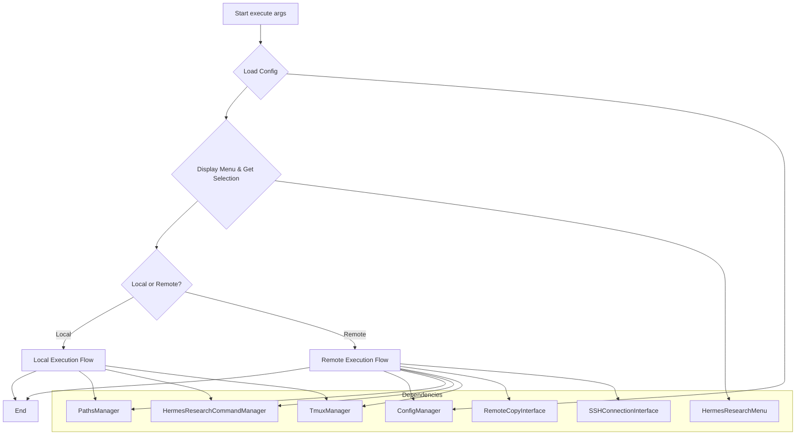
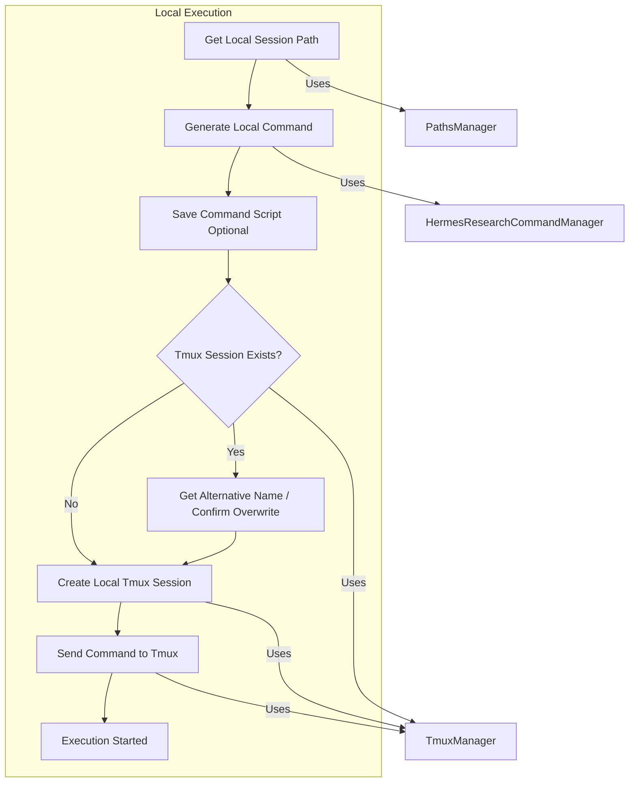

# HermesResearchCLI Implementation Plan

This document outlines the implementation strategy for the `HermesResearchCLI.execute` method, which orchestrates the process of preparing and launching a Hermes research task either locally or on a remote server via tmux.

## Core Logic Flow

The `execute` method acts as the central coordinator, leveraging various manager components provided via dependency injection.



**Steps:**

1.  **Receive Arguments (`args`):** Get parsed command-line arguments, including file paths and any extra Hermes arguments (`-c`).
2.  **Load Configuration:** Use `ConfigManager` to load `HermesConfig`.
3.  **Get User Selection:**
    *   Instantiate `HermesResearchMenu`.
    *   Set the loaded `config` on the menu instance.
    *   Call `menu.get_selection()` to interactively gather `session_name`, `model`, `budget`, `prompt`, and `selected_server_name`.
4.  **Determine Execution Target:** Check if `MenuSelection.selected_server_name` is `None`.
    *   If `None`, proceed to **Local Execution Flow**.
    *   If a server name is present, proceed to **Remote Execution Flow**.

## Local Execution Flow

This path executes the Hermes command directly on the local machine within a tmux session.



**Steps:**

1.  **Get Session Path:** Use `PathsManager.get_research_session_path` with the `research_directory` from config and the selected `session_name`.
2.  **Generate Command:** Use `HermesResearchCommandManager.generate_command`, providing:
    *   The local session path.
    *   Selected `model`, `budget`, `prompt`.
    *   Absolute paths of input files (`args.files`), resolved using `PathsManager.get_absolute_path`.
    *   Extra arguments (`args.extra_args`).
3.  **Save Command (Optional):** Use `HermesResearchCommandManager.save_command_in_file` to save the generated command to a script file within the session path for reference or debugging.
4.  **Manage Tmux Session:**
    *   Use `TmuxManager.list_sessions()` to check if a session with `session_name` already exists.
    *   If it exists, use `TmuxManager.determine_alternative_name` or prompt the user to confirm overwriting or choose a new name. Update `session_name` if necessary.
    *   Use `TmuxManager.create_session(session_name)`.
    *   Use `TmuxManager.send_command(session_name, generated_command)`.

## Remote Execution Flow

This path sets up the research on a configured remote server, copies necessary files, and starts the command in a remote tmux session.

```mermaid
graph TD
    subgraph Remote Execution
        RE1[Get Remote Server Config] --> RE2[Define Remote Paths];
        RE2 --> RE3[Generate Remote Command];
        RE3 --> RE4[Create Local Temp Script];
        RE4 --> RE5[Prepare File Map];
        RE5 --> RE6[Copy Files & Script to Remote];
        RE6 --> RE7[Configure Tmux for Remote];
        RE7 --> RE8{Remote Tmux Session Exists?};
        RE8 -- No --> RE9[Create Remote Tmux Session];
        RE8 -- Yes --> RE10[Get Alternative Name / Confirm Overwrite];
        RE10 --> RE9;
        RE9 --> RE11[Send Script Execution Command to Remote Tmux];
        RE11 --> RE12[Cleanup Local Temp Script];
        RE12 --> RE_End[Remote Execution Started];
    end

    RE1 -- Uses --> dep1[ConfigManager];
    RE2 -- Uses --> dep3[PathsManager];
    RE3 -- Uses --> dep4[HermesResearchCommandManager];
    RE5 -- Uses --> dep3;
    RE6 -- Uses --> dep6[RemoteCopyInterface];
    RE6 -- Needs --> dep7[SSHConnectionInterface];
    RE7 -- Uses --> dep5[TmuxManager];
    RE8 -- Uses --> dep5;
    RE9 -- Uses --> dep5;
    RE11 -- Uses --> dep5;

```



**Steps:**

1.  **Get Remote Config:** Retrieve the `HermesConfigRemoteServer` details (hostname, username, remote\_research\_path) from the loaded `config` using `MenuSelection.selected_server_name`. Create an `SSHDestination` object.
2.  **Define Remote Paths:**
    *   Determine the remote session path (e.g., `{remote_research_path}/{session_name}`).
    *   Determine the remote path for input files (e.g., `{remote_session_path}/input_files/`).
    *   Determine the remote path for the command script (e.g., `{remote_session_path}/run_research.sh`).
3.  **Generate Remote Command:** Use `HermesResearchCommandManager.generate_command`, providing:
    *   The *remote* session path.
    *   Selected `model`, `budget`, `prompt`.
    *   *Remote* paths for the input files (using the base names of `args.files` appended to the remote input file path).
    *   Extra arguments (`args.extra_args`).
4.  **Create Local Temp Script:** Create a temporary script file locally containing the generated command.
5.  **Prepare File Map:** Create a dictionary mapping local source paths to remote target paths:
    *   Map each absolute local input file path (`PathsManager.get_absolute_path(f)`) to its corresponding remote input file path.
    *   Map the local temporary script path to the remote script path.
6.  **Copy Files:** Use `RemoteCopyInterface.remote_copy_files` with the file map and the `SSHDestination`. The implementation of `RemoteCopyInterface` will handle the underlying SSH/SCP operations.
7.  **Configure Tmux for Remote:** Use `TmuxManager.set_remote(selected_server_name)`. *Note: The `TmuxManager` implementation needs to use this server name to correctly interact with the remote machine, likely using `SSHConnectionInterface` internally.*
8.  **Manage Remote Tmux Session:**
    *   Use `TmuxManager.list_sessions()` (which now operates remotely) to check for existing sessions.
    *   Handle existing sessions as in the local flow (alternative name/overwrite confirmation). Update `session_name` if needed.
    *   Use `TmuxManager.create_session(session_name)`.
    *   Generate the command to execute the script on the remote machine (e.g., `bash {remote_script_path}`).
    *   Use `TmuxManager.send_command(session_name, script_execution_command)`.
9.  **Cleanup:** Delete the local temporary script file.

## Dependency Injection

The `HermesResearchCLI` class will receive instances of all required manager interfaces (`ConfigManagerInterface`, `HermesResearchMenuInterface`, `PathsManagerInterface`, `HermesResearchCommandManagerInterface`, `TmuxManagerInterface`, `RemoteCopyInterface`, `SSHConnectionInterface`) through its constructor. The `main` function or application entry point will be responsible for instantiating the concrete implementations and injecting them.

## CLI Argument Parsing (`define_cli`)

The `define_cli` method needs to be updated:

1.  Keep the `files` positional argument (`nargs="*"`).
2.  Add an optional argument for extra parameters, e.g., `-c` or `--command-args`:
    ```python
    parser.add_argument(
        "-c", "--command-args",
        help="Additional arguments to pass directly to the hermes command, enclosed in quotes.",
        type=str,
        default=""
    )
    ```
The `args.command_args` value will then be passed to `HermesResearchCommandManager.generate_command`.
