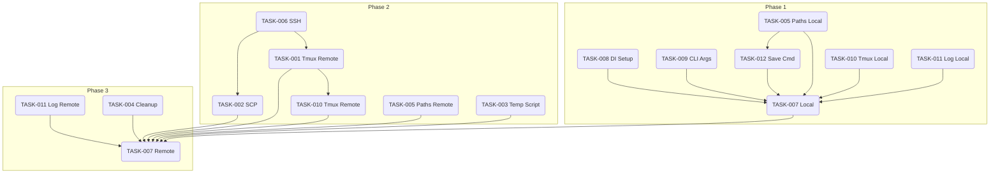

# Hermes Research CLI - Project Plan (TASK-013)

## 1. Project Charter & Scope

**Goal:** Develop a command-line interface (`hermes-research`) that allows users to easily configure and launch Hermes AI research tasks, either locally or on a remote server, using tmux for session management.

**Scope:**

*   **In Scope:**
    *   Interactive menu for configuration (session name, model, budget, prompt, execution target).
    *   Configuration management via `config.ini` (research directory, default budget, models, remote servers).
    *   Local execution: Launching `hermes` command in a local tmux session.
    *   Remote execution:
        *   Connecting via SSH (using system `ssh` and config).
        *   Copying necessary files (input files, generated script) via SCP (using system `scp`).
        *   Creating temporary directories on the remote server.
        *   Launching `hermes` command (via a script) in a remote tmux session.
    *   Handling of existing tmux sessions (prompting/alternative naming).
    *   Passing additional arguments to the `hermes` command (`-c`).
    *   Basic error handling and resource cleanup (local temp script, potentially remote temp dir).
    *   Informative user feedback during execution.
    *   Dependency injection for modularity.
    *   Unit testing for core components.
    *   Documentation (use cases, implementation plan, philosophy, tasks).
*   **Out of Scope (Initial Version):**
    *   Advanced configuration options beyond the menu.
    *   Complex remote resource management (beyond temp dir cleanup).
    *   Support for SSH protocols other than standard OpenSSH client usage (e.g., no direct Paramiko integration initially).
    *   Password-based SSH authentication (relies on key-based auth configured in user's `~/.ssh/config`).
    *   Automatic installation/management of `hermes` or `tmux` locally or remotely.
    *   GUI interface.
    *   Real-time monitoring of the launched `hermes` process.
    *   Highly configurable cleanup strategies (e.g., keeping temp files based on flags).

## 2. Risks & Mitigation

| Risk                                       | Likelihood | Impact | Mitigation Strategy                                                                                                |
| :----------------------------------------- | :--------- | :----- | :----------------------------------------------------------------------------------------------------------------- |
| SSH Connection/Authentication Issues       | Medium     | High   | Rely on system `ssh` and user's `~/.ssh/config`. Provide clear error messages. TASK-006 focuses on robust testing. |
| SCP File Transfer Failures                 | Medium     | High   | Implement basic error checking in TASK-002. Provide clear error messages. Ensure remote paths/permissions are valid. |
| Tmux Command Failures (Local/Remote)       | Low        | Medium | Ensure correct tmux commands are generated. Check return codes. TASK-001 addresses remote tmux.                      |
| Inconsistent Remote Environments           | Medium     | Medium | Assume standard POSIX environment with `bash`, `mkdir`, `tmux`. Document assumptions.                              |
| Scope Creep                                | Medium     | Medium | Adhere strictly to the defined scope. Defer non-essential features.                                                |
| Dependency Issues (Managers)               | Low        | High   | Use clear interfaces and dependency injection (TASK-008). Test integration early.                                  |
| Error Handling/Cleanup Complexity (Remote) | Medium     | Medium | Start with basic cleanup (local temp script). Address remote temp dir cleanup in TASK-004, potentially deferring full cleanup if too complex initially. |
| Path Management Complexity (Local/Remote)  | Low        | Medium | Clearly define path strategies in TASK-005. Use `PathsManager` consistently. Test thoroughly.                      |

## 3. Dependencies & Task Sequencing

The core functionality revolves around TASK-007 (CLI Execution Logic), which depends on almost all other tasks. A logical sequence prioritizes building foundational components first.

**Proposed Phasing:**

**Phase 1: Foundational Setup & Local Flow**

1.  **TASK-008: Implement Dependency Injection Setup:** Establish the DI framework early.
2.  **TASK-009: Update CLI Argument Parsing:** Implement the `-c` argument handling.
3.  **TASK-005: Refine Path Strategy:** Confirm/implement local path logic in `PathsManager` and usage in `CommandManager`.
4.  **TASK-012: Implement Optional Local Command Saving:** Implement saving the command script locally.
5.  **TASK-010: Implement Tmux Session Name Handling (Local Part):** Implement local session checking and naming logic in `TmuxManager`.
6.  **TASK-011: Implement User Feedback/Logging (Local Part):** Add basic logging and user feedback for the local flow.
7.  **TASK-007 (Partial - Local Flow):** Implement the local execution path within `HermesResearchCLI.execute`, integrating the components above.

**Phase 2: Remote Execution Components**

8.  **TASK-006: Implement SSHConnectionInterface:** Ensure `SubprocessSSHConnection` is robust and tested.
9.  **TASK-002: Implement RemoteCopyInterface:** Implement SCP-based file copying.
10. **TASK-001: Implement Remote Tmux Functionality:** Extend `TmuxManager` for remote operations using SSH.
11. **TASK-005 (Remote Part):** Confirm/implement remote path logic (`final`, `temp`) in `PathsManager` and usage in `CommandManager`.
12. **TASK-003: Define Strategy for Temporary Local Script:** Decide and implement temporary script handling.
13. **TASK-010 (Remote Part):** Ensure tmux session handling works remotely.

**Phase 3: Remote Flow Integration & Cleanup**

14. **TASK-007 (Partial - Remote Flow):** Implement the remote execution path within `HermesResearchCLI.execute`, integrating Phase 2 components.
15. **TASK-011 (Remote Part):** Add user feedback specific to the remote flow.
16. **TASK-004: Analyze and Implement Error Handling & Resource Cleanup:** Implement cleanup, focusing on local temp script and deciding on remote temp dir strategy.

**Dependency Graph (Simplified):**

## 4. Open Questions

1.  **TASK-004 (Cleanup):** What is the desired default behavior for the remote temporary directory (`/tmp/hermes_research/{uuid}/`)? Always delete on success? Leave for debugging? Make it configurable later? *Initial Decision:* Delete on successful start, leave on error for debugging. Revisit if needed.
> Leave for debugging, also while hermes is running (which might take long time, we just start, we don't wait to finish), the files certainly need to be there
2.  **TASK-010 (Tmux Naming):** When a session exists, should we automatically generate an alternative name (e.g., `session_1`) or prompt the user to overwrite/rename? *Initial Decision:* Prompt the user via `MenuManager` for clarity and control.
> Agreed. Also, have a suffix for the tmux session names, to separate them from the rest of the names
3.  **TASK-006/TASK-002 (SSH/SCP):** How robustly should we handle diverse `~/.ssh/config` options (e.g., `ProxyCommand`)? *Initial Decision:* Rely on the system `ssh`/`scp` commands to handle the config transparently. Avoid parsing the config file directly.
> Yes, rely on ssh/scp cli commands
4.  **Local Research Directory:** Should the application create the base `research_directory` specified in the config if it doesn't exist, or assume it exists? *Initial Decision:* Assume it exists, but `PathsManager.get_research_session_path` or `CommandManager.save_command_in_file` should create the specific *session* subdirectory.
> We should create the parent as well if it doesn't exist

## 5. Timeline / Phasing

*   **Phase 1 (Foundational & Local):** Estimated 1-2 development cycles. Goal: Working local execution.
*   **Phase 2 (Remote Components):** Estimated 2-3 development cycles. Goal: Core remote capabilities implemented and tested individually.
*   **Phase 3 (Integration & Cleanup):** Estimated 1-2 development cycles. Goal: Working remote execution, basic cleanup, and refinement.

*(Note: "Development cycle" is abstract; adjust based on actual effort per task.)*

This plan provides a structured approach. We will tackle tasks sequentially based on the proposed phasing, updating `tasks.md` as we progress.
